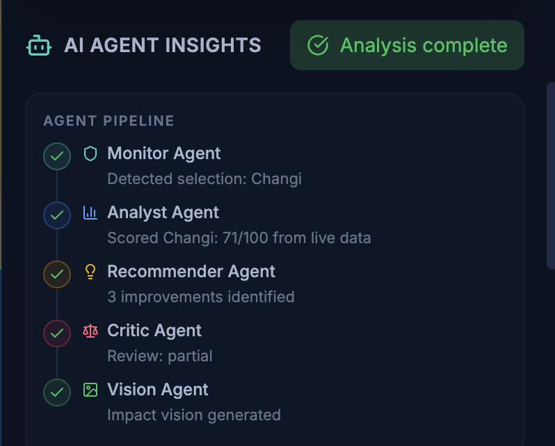

LiveableCity Agent
An agentic AI platform that autonomously monitors, scores, and generates improvement plans for Singapore's urban districts — measuring both urban liveability and environmental outcomes through a coordinated multi-agent pipeline.

Built for Hack for Cities 2026 — SMU x IBM Hackathon.

Table of Contents
Problem Statement
Solution Overview
Features
Architecture
Tech Stack
Data Sources
Supabase Schema
Getting Started
Environment Variables
Project Structure
Workflow Explanation
License
Problem Statement
How can Agentic AI be used to improve efficiency in collectively improving urban liveability and environmental outcomes at a district or nationwide level?

Urban planning in Singapore today relies on fragmented dashboards, periodic reports, and manual cross-referencing of datasets. A planner assessing a district must individually consult PSI readings, transport maps, park locations, dengue alerts, and rainfall data — then synthesise these into recommendations through their own expertise. This process is slow, inconsistent across planners, and reactive: problems are addressed after they manifest rather than predicted and prevented.

Existing smart city platforms provide data visualisation but lack agency. They display metrics without interpreting them, show scores without generating plans, and present findings without questioning their own conclusions.

Solution Overview
LiveableCity Agent deploys five autonomous AI agents that work as a coordinated pipeline:

Monitor real-time data from Singapore government APIs
Analyse districts across liveability and environmental dimensions
Recommend targeted improvements via Gemini AI
Critique those recommendations through adversarial debate
Visualise the proposed improvements with AI image generation
The system maintains persistent memory across sessions, learns from past outcomes, and generates predictive alerts — shifting urban planning from reactive dashboard monitoring to proactive, AI-driven decision support.

Features
📊 Dual Scoring System
Every district receives two independent scores (0–100):

Dimension	Pillars	Weights
Liveability	Transport Access, Green Space, Air Quality, Amenities, Safety	25%, 20%, 20%, 20%, 15%
Environmental	Air Quality Impact, Green Coverage, Vector Safety, Climate Resilience	35%, 30%, 20%, 15%
Both scores are visible across the entire platform — map tooltips, side panel, leaderboard, and analytics.

### 🤖 Multi-Agent AI Pipeline
Five specialised agents execute in sequence:
| Agent | Role | Technology |
|-------|------|------------|
| **Monitor Agent** | Detects district selection, triggers pipeline | Event-driven |
| **Analyst Agent** | Fetches live data, computes dual scores | data.gov.sg APIs + GeoJSON |
| **Recommender Agent** | Generates prioritised improvement plans | Google Gemini (gemini-2.0-flash) |
| **Critic Agent** | Reviews recommendations, challenges assumptions | Google Gemini (separate call) |
| **Vision Agent** | Analyses urban photos + generates improved versions | GPT-4o + Gemini Image Gen |

The pipeline is visualised in real-time with animated status indicators for each agent stage.

🧠 Agent Memory & Learning
The system remembers past recommendations and their outcomes, building institutional knowledge over time.

How it works:

After each recommendation cycle, the system saves the district, recommendation content, and score snapshot to persistent storage
On subsequent analyses of the same district, past memories are injected into the Gemini prompt as context
The getContextForPrompt() method formats the 5 most recent memories with outcome data (score deltas)
The AI adapts: avoids repeating failed suggestions, doubles down on what worked
Storage: Supabase (primary) with automatic localStorage fallback if Supabase is unavailable.

### ⚔️ Multi-Agent Deliberation

Recommendations are not accepted at face value. The Critic Agent autonomously reviews each plan:

1. **Recommender Agent** — Generates the improvement plan
2. **Critic Agent** — Challenges weak points, flags missing considerations
3. **Recommender Agent** — Defends or adjusts recommendations (rebuttal)
4. **Consensus** — Final plan with agreement status (agree / partial / disagree)

This three-call deliberation pattern (Recommender → Critic → Rebuttal) produces self-reviewed, consensus-tested plans rather than unchallenged AI output.

🏙️ Urban Vision AI
Upload any street-level or aerial photo and get:

AI Analysis — Scores across 5 categories: greenery, infrastructure, cleanliness, accessibility, safety
Issues & Suggestions — Specific problems identified and actionable improvements proposed
Before/After Visualisation (Gemini Image Gen) — A generated image showing what the area could look like after improvements

📈 Analytics Dashboard
City-wide breakdown with a dimension toggle between Liveability and Environmental:

- Donut Chart — Weighted pillar breakdown
- Metric Bars — City-wide averages per pillar
- Deficit Analysis — Weighted gap to perfect score, showing where investment moves the needle most
- District Heatmap — All districts ranked and colour-coded
- Switching between dimensions recalculates the entire page.

🔮 Predictive Insights
AI-generated forecasts classified by severity:

| Severity | Meaning |
|----------|---------|
| 🔴 **Critical** | Immediate attention required |
| 🟡 **Warning** | Emerging risk to monitor |
| 🔵 **Info** | Trend or observation |

Each insight includes a **confidence score** (0–100%) and is tagged by category (greenery, transport, safety, infrastructure). Insights are generated via an **n8n automation workflow** that periodically processes data and stores results in Supabase.

### 🗺️ Interactive District Map

- **Leaflet-based** Singapore map with GeoJSON planning area boundaries
- **Dual score tooltips** on hover: `Liveability: 72 | Environment: 65`
- **Colour-coded districts** by score (green → amber → red)
- **Layer controls** to toggle amenity overlays (parks, hawkers, dengue clusters, MRT stations, etc.)
- **Click-to-analyse** any district to trigger the full agent pipeline

Architecture
System Architecture
The platform is built as a five-layer stack:

Frontend — React 19 + Vite 7 with four main pages: Dashboard, Analytics, Urban Vision, and Predictive Insights
Agent Pipeline — Five sequential agents: Monitor → Analyst → Recommender → Critic → Vision
Service Layer — Three core services:
agentService.js — Orchestrates the agent pipeline, calls Gemini, manages deliberation
scoringService.js — Computes dual liveability and environmental scores from raw data
agentMemory.js — Persists recommendations and outcomes to Supabase (falls back to localStorage)
Data Layer — Four data sources feed the scoring engine:
data.gov.sg — Real-time PSI readings and rainfall station data
GeoJSON files — Bundled datasets for parks, hawkers, supermarkets, dengue clusters, gyms, childcare, cycling paths
OneMap API — Population and demographic data
Supabase — Two tables: agent_memory (learning loop) and predictive_insights (forecasts)
AI Models — Two providers:
Google Gemini — gemini-2.0-flash for recommendations, critique, and rebuttal; gemini-2.0-flash-exp-image-generation for vision improvements
OpenAI GPT-4o — Urban image analysis in the Vision feature
Data Pipeline
Raw data flows through three stages:

Stage 1: Data Ingestion — The scoring service fetches PSI and rainfall readings from data.gov.sg in real-time (cached for 10 minutes), and loads bundled GeoJSON datasets for parks, hawkers, supermarkets, dengue clusters, gyms, and childcare centres.

Stage 2: Score Computation — For each district centroid, the service runs haversine distance calculations to count nearby amenities within defined radii (2km for amenities, 3km for parks, 1km for dengue clusters). PSI readings are converted to air quality scores, and rainfall readings are converted to climate resilience scores. Two weighted scores are produced:

Liveability Score = Transport (25%) + Air Quality (20%) + Green Space (20%) + Amenities (20%) + Safety (15%)
Environmental Score = Air Quality (35%) + Green Coverage (30%) + Vector Safety (20%) + Climate (15%)
Stage 3: Agent Processing — The agent service takes the computed scores, injects past memory context from Supabase, calls Gemini to generate improvement recommendations, runs the Critic → Rebuttal deliberation, and saves the result back to agent memory for future learning.

Scoring Methodology
Air Quality — PSI values are mapped to scores: 0–50 PSI = 85–95 (Good), 51–100 = 65–85 (Moderate), 101–150 = 45–65 (Unhealthy), 151–200 = 30–45 (Very Unhealthy), 200+ = 10–30 (Hazardous).

Climate Resilience — Rainfall is scored by intensity: 0 mm/hr = 60 (dry/heat stress), 1–5 = 90 (ideal), 5–20 = 75 (good), 20–50 = 55 (heavy), 50+ = 40 (flood concern).

Transport — base 40 + (MRT stations × 8), capped at 95.

Green Space — base 40 + (parks within 3km × 6), capped at 95.

Amenities — base 35 + (hawkers × 5) + (supermarkets × 3) + (childcare × 2) + (gyms × 2), capped at 95.

Safety — base 85 − (dengue clusters within 1km × 10), floor at 40.

Workflow Explanation
1. District Analysis Flow
When a user clicks a district on the map, the Monitor Agent detects the selection and triggers the pipeline. The Analyst Agent calls scoringService.computeDistrictScore(), which fetches PSI and rainfall from data.gov.sg, loads all GeoJSON datasets, and computes both the Liveability Score (5 pillars) and Environmental Score (4 pillars). The Recommender Agent then retrieves past memories for that district via agentMemory.getContextForPrompt(), injects them into a Gemini prompt alongside the current scores, and generates a prioritised improvement plan. The Critic Agent makes a separate Gemini call to challenge the recommendations, identifying agreements, disagreements, and alternative suggestions. The Recommender then rebuts with a third Gemini call, producing a final consensus-tested plan. The result is saved to agent memory and displayed in the side panel: dual ScoreRings, a liveability/environmental tab breakdown, improvement plan cards, the deliberation thread, and past memories.

2. Predictive Insights Flow
An n8n automation workflow runs on a schedule, processing data.gov.sg feeds and historical patterns to generate severity-classified predictions (critical, warning, info) with confidence scores. These are inserted into the predictive_insights Supabase table. The frontend polls Supabase every 30 minutes via the usePredictiveInsights hook, groups insights by district, and displays them with colour-coded severity badges and confidence bars.

3. Urban Vision Flow
The user uploads a street-level or aerial photo. GPT-4o analyses the image across five categories (greenery, infrastructure, cleanliness, accessibility, safety), identifies specific issues, generates improvement suggestions, and creates a detailed image prompt. When the user clicks "Generate Improved Version", Gemini's image generation model renders an improved version of the scene based on that prompt. The result is displayed as a side-by-side before/after comparison.

 Built with ❤️ for Hack for Cities 2026 — SMU x IBM Hackathon 

